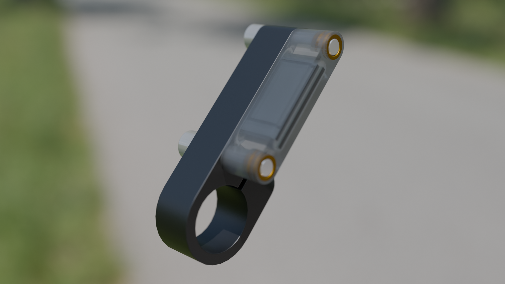

# Gear-indicator
A system to monitor the selected gear for bicycles, for those who do not trust their memory

Headunit - a device to display the current gear
Gearunit - a device to transmit the current position of two cables, doubles as a power supply

### System manifest

The main idea of the system is to minimize interaction with the user, reduce buttons and/or settings to the minimum.

The system is designed for long-term/permanent installation and should require minimal maintenance. All its modules should be waterproof and vandal-resistant.

System retains its settings in the local RAM of the corresponding units, always powered from the Battery/shifter unit. If that battery goes flat, all system parameters are lost, and calibration (or learning) should be performed after turning on. Modules can be disconnected from power independently, so it will affect only the related module parameters. 

### Calibration

Whatever position the shifter was left in, it will be considered a first gear after the cold start. First shift has to be upwards, even an incomplete one, to point the cable’s forward direction. If the Headunit reads values outside of the known range, the current gear indicator will move away, and if the value stays stable for ~2 seconds, the gear count and associated shifter value table will be updated.

To save battery, all modules should go in and out of deep sleep upon Headunit's request. While active, deep sleep should be triggered if no movement is detected for a minute. 
While in a deep sleep, any movement should trigger a deep sleep exit.

With an IMU within the battery module firmly attached to the bicycle frame, it is possible to estimate bike speed.

Braking range can be determined and dynamically expanded on the fly.
